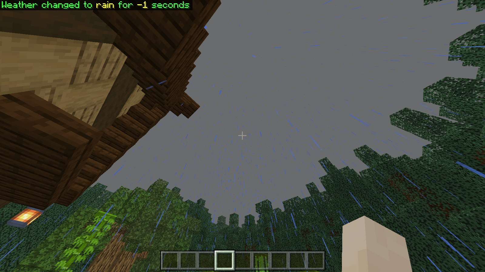

# VanillaWeather by WeaVerseStudio
### Description:
> A plugin that adds weather mechanics like in vanilla.
### Authors:
> PrograMistV1 - made major contributions to the writing of the plugin.
### Commands:
> /weather <clear|rain|thunder> [duration: int] - Players who have permission can change the current weather if they wish, by entering one of the following commands: /weather rain [*duration*] or /weather thunder [*duration*], and /weather clear [*duration*] to clear the inclement weather. The **time** parameter is the duration of the weather in seconds.
If you want to prevent weather changes in the world, then set the time value to -1.
### Screenshots:

### Necessary conditions:

